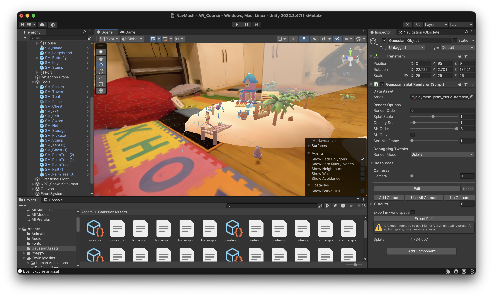
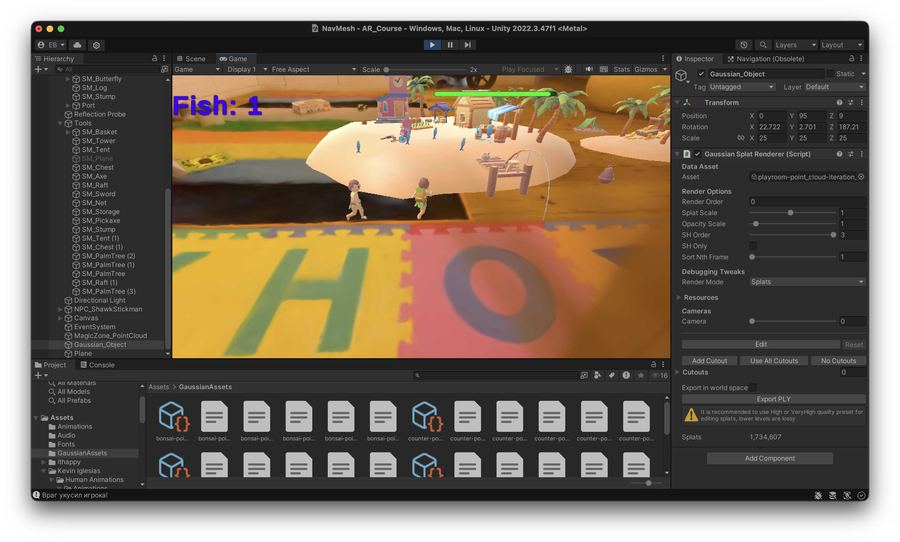
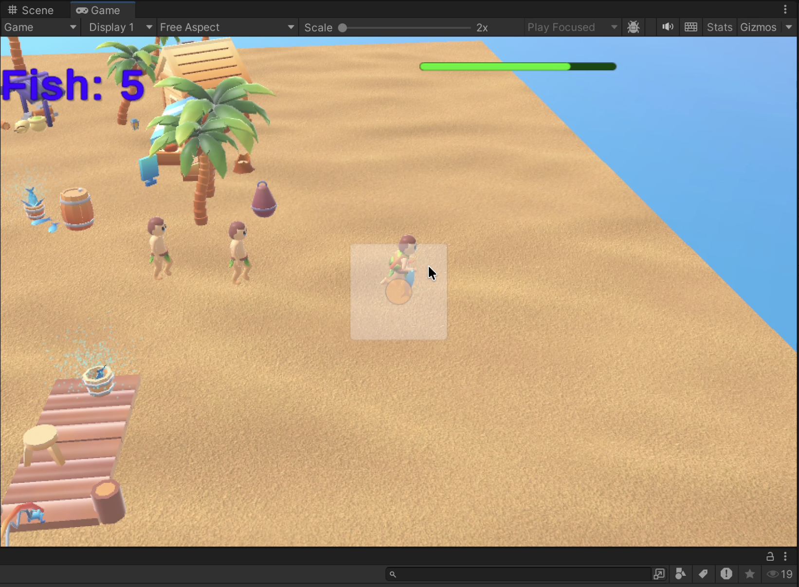
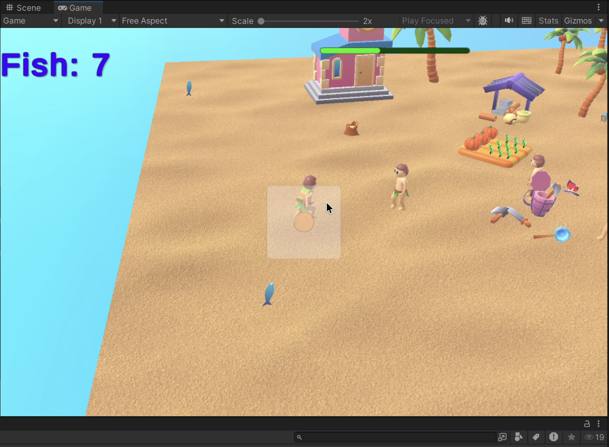
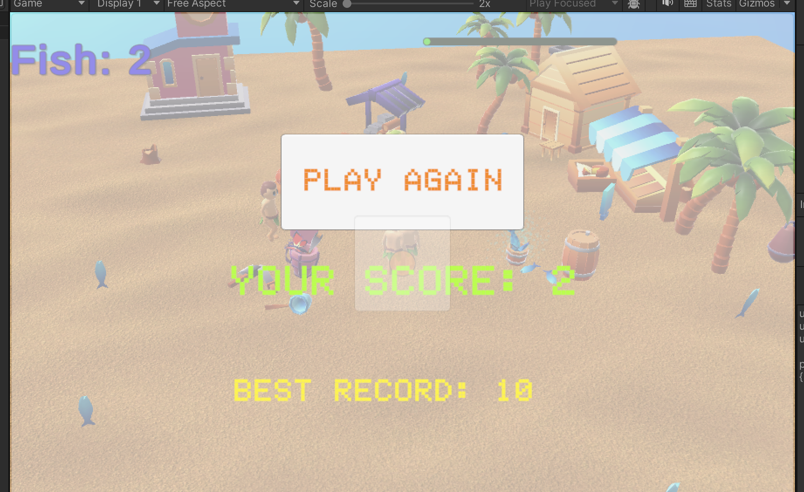
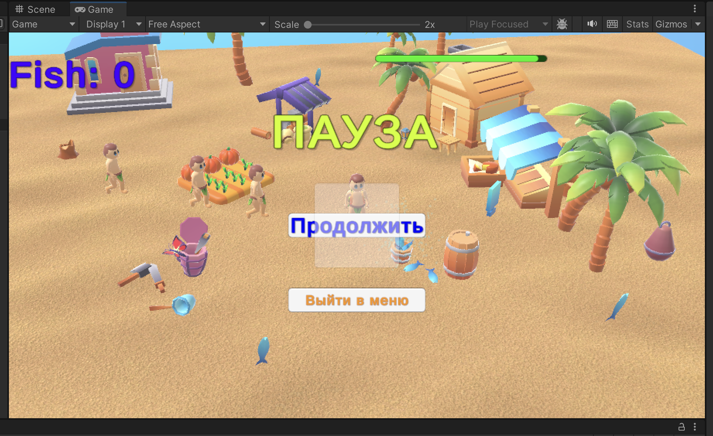

# AR Course Project: "Дополненная реальность в компьютерном зрении"

Проект разработан в рамках курса магистратуры. Это полноценная AR-игра, сочетающая классические игровые механики (AI, сбор предметов, UI) и современные технологии компьютерного зрения.

## Особенности проекта

*   **AR-платформа**: Интеграция с Vuforia Engine для точного распознавания маркеров и размещения игровой арены в реальном пространстве.
*   **Gaussian Splatting**: Интеграция фотореалистичного окружения (плагин Aras-p). В проекте реализована комната, созданная на основе облака точек (PLY), совмещенная с игровыми объектами.
*   **Динамическая навигация (NavMesh)**: Реализовано динамическое запекание навигационной сетки на AR-маркере. Персонажи корректно обходят препятствия (дома, деревья) прямо на поверхности стола.
*   **NPC*: Противники используют NavMeshAgent для преследования игрока, вычисляя кратчайшие пути и обходя динамические препятствия.
*   **Управление**: Поддержка управления персонажем как через клавиатуру (WASD), так и через клики мыши/тапы (Raycasting).
*   **Система прогресса**: Сбор бонусов (рыбки) с визуальными эффектами, звуковым сопровождением и сохранением рекордов через `PlayerPrefs`.

## Технический стек

*   **Движок**: Unity 2022.3.47f1
*   **Язык**: C#
*   **Оптимизация**: Проект адаптирован под архитектуру **Apple Silicon** с учетом особенностей работы плагинов дополненной реальности.
*   **AR SDK**: Vuforia Engine.
*   **Визуал**: UnityGaussianSplatting, пакеты анимаций Kevin Iglesias (Humanoid).

## Игровой процесс

Игрок управляет персонажем на тропической арене. Задача — собрать все бонусы, избегая столкновений с противниками. Игра включает:
1.  **Главное меню**: Стилизованный интерфейс старта.
2.  **HUD**: Отображение счета и полоски здоровья в реальном времени.
3.  **Меню паузы**: Возможность приостановить игру (ESC) без потери AR-трекинга.
4.  **Game Over**: Экран завершения игры с выводом текущего результата и лучшего рекорда.

## Галерея (Showcase)

| Интеграция в реальную комнату (Gaussian Splatting) | Игровой процесс в AR |
|---|---|
|  |  |

| Навигация персонажей | Система частиц и бонусы |
|---|---|
|  |  |

| Меню GameOver | Меню паузы |
|---|---|
|  |  |

## Академический контекст
Проект выполнен студенткой магистратуры в рамках изучения технологий компьютерного зрения и методов их применения в разработке ПО с дополненной реальностью.
